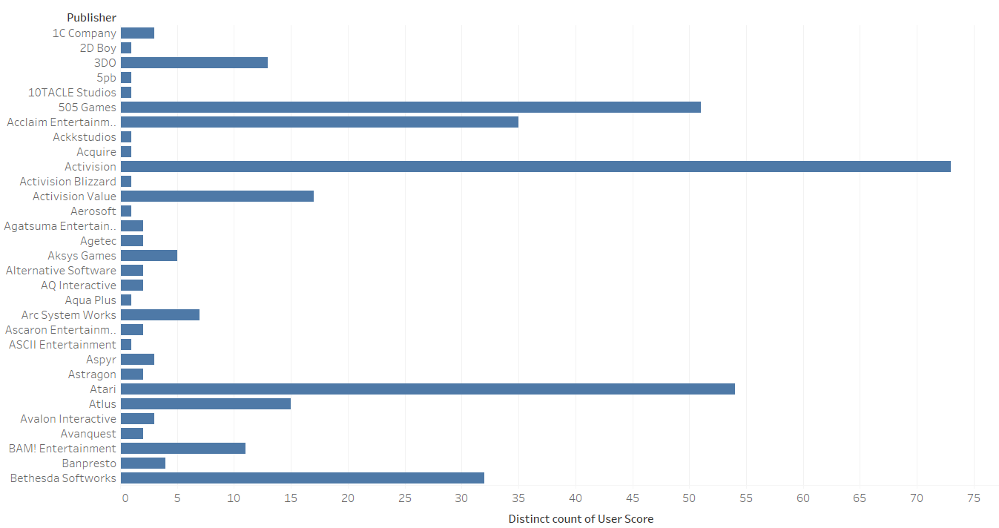
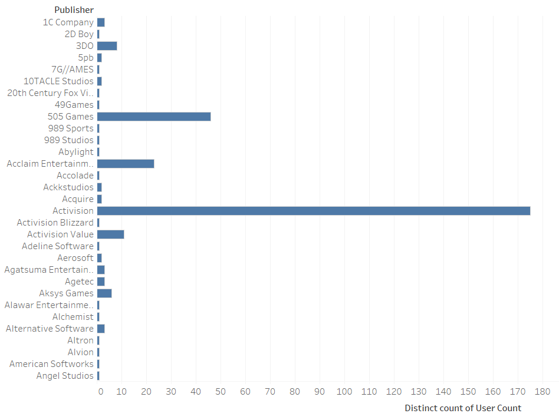
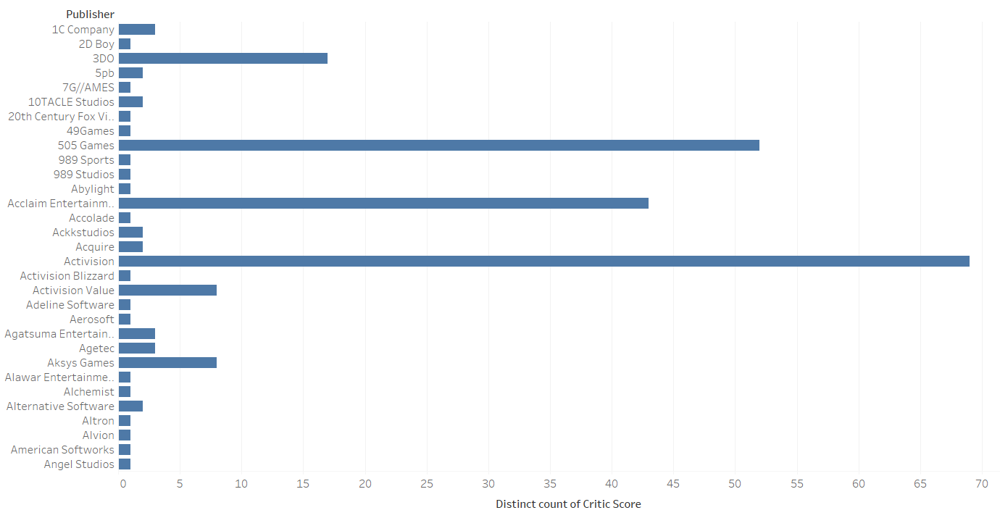
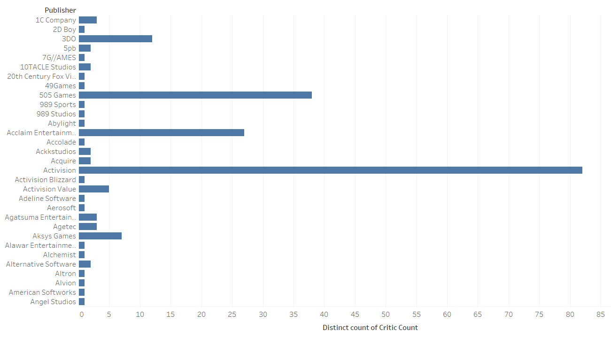
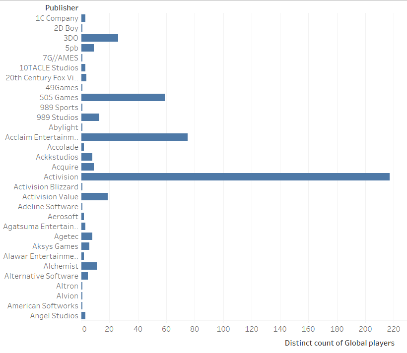
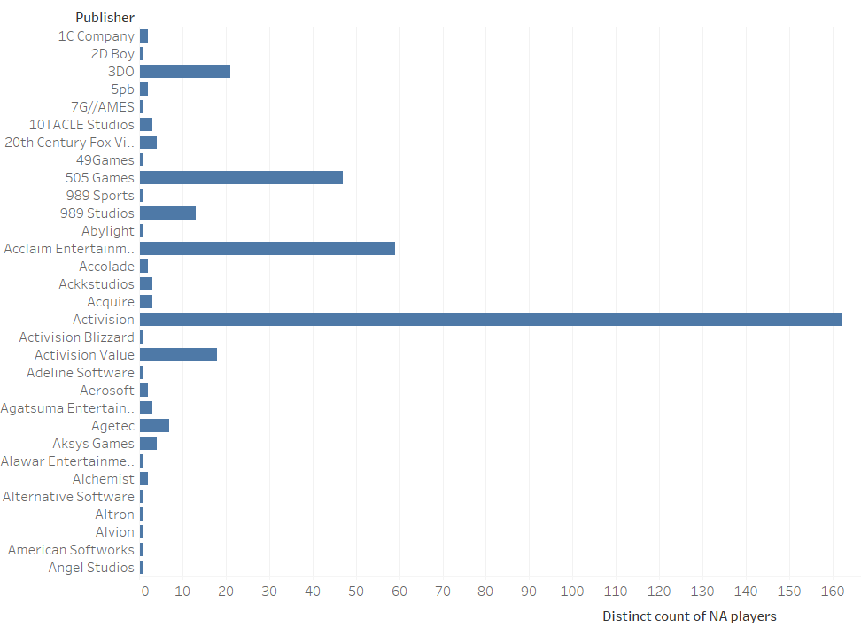
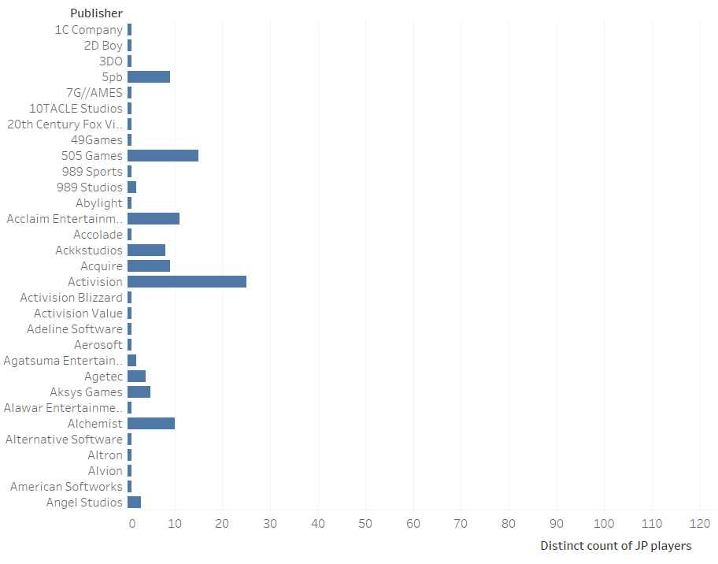
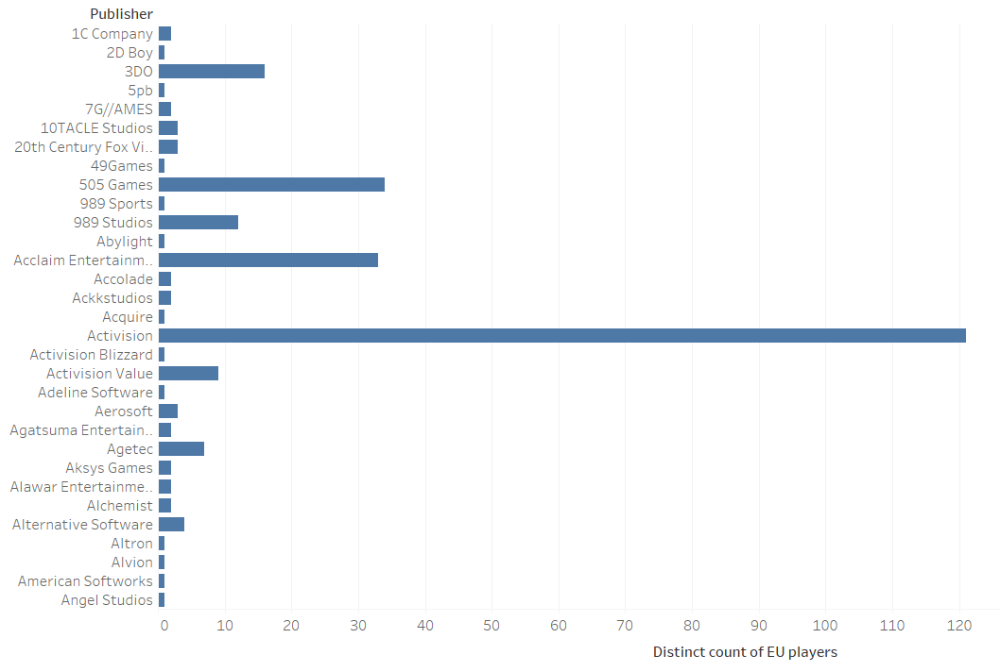
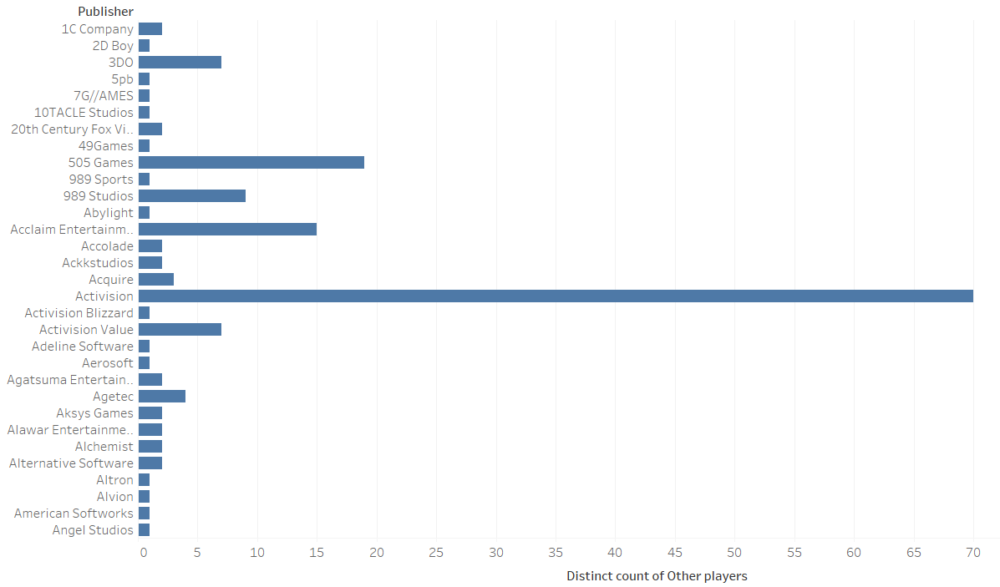

## Data Exploration of video game sales of 2019
### Introduction
  The Core discovery I made is that Activision is the most popular video game developer. My supporting arguments is that Activision got the most sales from different places and got the heighest critic and user score and count. I will be using bar graphs to prove them
### Data Set
[Link](https://www.kaggle.com/juttugarakesh/video-game-data?select=video_game.csv)
Juttuga Rakesh produced this Data set because he wanted to measure the sales of video games. The data set focus on the sales of NA (North America), JP (Japan), EU (Europe), other, and global players. In other to get closer results of the sales, The data set includes the name games, the platforms, the year of releases, the genres, the developers, the critic score and count, the user score and count, the publisher, and the ratings. I am interested in this data set because I like collecting data that involves video games.
### Initial Questions
The desire to use a data set involving video games is what drove me to this data. I was about currious what publisher got the most sales in different places. I came up with questions involving different places the publishers sold games too. What surprised me with this data is that there were several empty spaces in the user and critic score and count columns. This data set was easy to work with so there was no need to wrangle it.
### Discoveries and Insights

The bar graph above shows that Activision got the heighest user score among all of the other publishers that were in the data set

The bar graph above shows that Activision got the heighest user count among all of the other publishers that were in the data set

The bar graph above shows that Activision got the heighest critic score among all of the other publishers that were in the data set

The bar graph above shows that Activision got the heighest critic count among all of the other publishers that were in the data set

The bar graph above shows that Activision got the most sales from all of the global players that were in the data set

The bar graph above shows that Activision got the most sales from all of the North American players that were in the data set

The bar graph above shows that Activision got the most sales from all of the Japan players that were in the data set

The bar graph above shows that Activision got the most sales from all of the Europe players that were in the data set

The bar graph above shows that Activision got the most sales from all of the other players that were in the data set
### Conclusion

