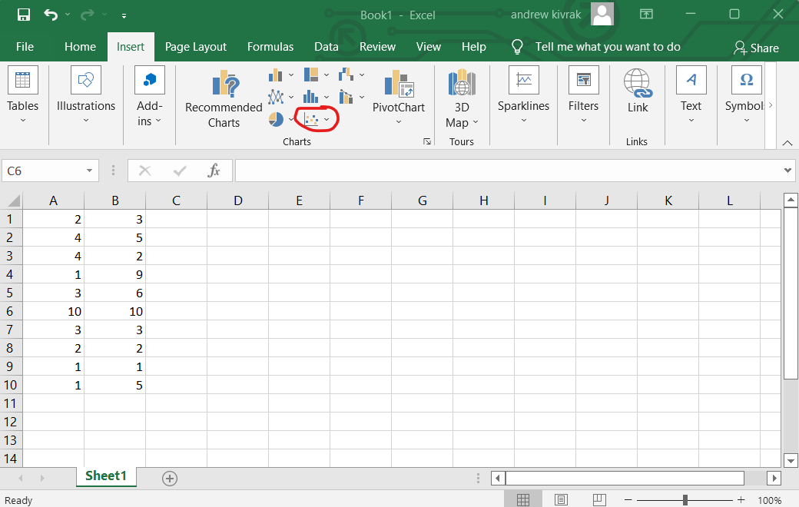

## Scatter Plot 101
### What is a Scatter Plot
A scatter Plot is a data graph that displays values for sets of data and create predictions based on the data. Like all graphs, it has an X and Y axis. Scatter Plots are mostly made up of a buch of dots. Each dot on the graph represents a single piece of data that got collected. The dots can be randomly over the graph or can be linear. 
### Why we use Scatter Plot
We use scatter plots to make predictions based on the data that got collected. They can also be used to find patterns in the data that can be linear, non-linear, or null. The main use of Scatter plots is to find gaps in the collected data and segment that data into groups.
### How To Make a Scatter Plot
STEP 1: Open Excel and put some data (numbers) in the cells and then select all of them

###
STEP 2: Click the Insert tab and Select the most bottom right drop-down menu in the Charts section named "Insert Scatter (X,Y) or Bubble Chart".

###
STEP 3: Click the top left graph in Scatter and then you got your scatter plot graph.

### Examples
Linear Scatter Plot

###
Non-Linear Scatter Plot

###  Data Link
[Data](https://github.com/Violagameboy/AdvancedDataScience/blob/gh-pages/Data.xlsx)
